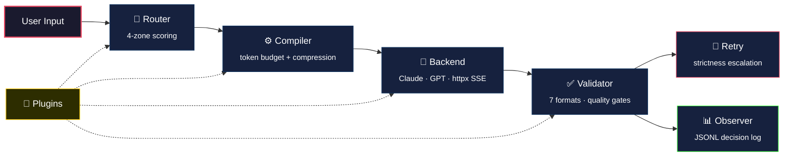

# Prompt Compiler

> Universal CLI middleware that intercepts user input, classifies intent, injects optimized prompt templates, and returns structured responses.

[](CHANGELOG.md)
[](LICENSE)
[](pyproject.toml)
[](#test-suite)

---

## Overview

`promptc` sits between you and any AI backend. Type a natural-language request; it routes to the best template, compiles a token-budgeted prompt with security delimiters, sends it, validates the response, and logs the decision — all in one pipeline.

**Key principles:**
- Every user input is routed through a 4-zone scoring engine (exact → keyword → fuzzy → fallback)
- Prompts are compiled with token-budget-aware compression across 4 levels
- User input is always wrapped in adversarial-resistant delimiters
- All decisions are logged as JSONL with UTC timestamps for full auditability
- Plugin hooks at every pipeline stage (compile, route, backend, validate)

## Architecture



## Pipeline Stages

| Stage | Module | Responsibility |
|---|---|---|
| **Route** | `routing/` | 4-zone template matching with bilingual triggers (EN/KA) |
| **Compile** | `compilation/` | Token-budgeted assembly with 4 compression levels |
| **Adapt** | `adapters/` | Backend-specific payload formatting (Claude, GPT) |
| **Send** | `adapters/transport` | Real HTTP dispatch via httpx (streaming + non-streaming) |
| **Validate** | `validation/` | 7-format schema validation + 3 quality gate evaluators |
| **Retry** | `validation/retry_engine` | Strictness escalation across compression levels |
| **Log** | `observability/` | JSONL decision logging, metrics, pruning, rotation, search |
| **Plugin** | `plugins/` | Hook injection at all 4 stages with 5s timeout enforcement |

## Builtin Templates

| Template | Category | Triggers |
|---|---|---|
| `code-review` | Evaluative | "review this code", "check for bugs", "კოდის რევიუ" |
| `explain` | Instructional | "explain async/await", "what is a closure?", "ახსენი" |
| `architecture` | Generative | "design a microservice", "plan the API", "არქიტექტურა" |
| `security-audit` | Evaluative | "security audit", "vulnerability scan", "უსაფრთხოება" |

> Custom templates: add TOML files to `~/.local/share/prompt-compiler/templates/`

## Quick Start

```bash
# Install
git clone git@github.com:Evil-Null/promptc.git
cd promptc
python -m venv .venv && source .venv/bin/activate
pip install -e ".[dev]"

# Verify
mycli version          # → 1.1.0
mycli health --strict  # → all checks pass
pytest -q              # → 1278 passed
```

## Authentication

Set your backend API key as an environment variable:

```bash
# Standard API key
export ANTHROPIC_API_KEY="sk-ant-api03-..."

# Claude setup token (OAuth) — auto-detected by prefix
export ANTHROPIC_API_KEY="sk-ant-oat01-..."

# OpenAI
export OPENAI_API_KEY="sk-..."
```

**Setup token auto-detection:** If the key starts with `sk-ant-oat01-`, promptc automatically switches to OAuth mode — `Authorization: Bearer` header, `oauth-2025-04-20` beta, and billing attribution injected into the system prompt. Standard API keys use `x-api-key` header as usual. No extra configuration needed.

## CLI Reference

### Core Commands

```bash
mycli version                                    # Print version
mycli health                                     # System health check
mycli health --strict --json                     # Strict mode, JSON output
mycli templates                                  # List available templates
```

### Route & Compile

```bash
mycli route "review this code for bugs"          # Route to best template
mycli route "review this code" --json            # JSON output
mycli route "review this code" --file main.py    # Attach file context

mycli compile "explain closures" --template explain              # Compile prompt
mycli compile "explain closures" --template explain --json       # JSON output
mycli compile "explain closures" --template explain --max-tokens 4096
```

### Run (Full Pipeline)

```bash
mycli run "review my auth module" --backend claude --dry-run     # Dry run
mycli run "review my auth module" --backend claude --stream      # Streaming
mycli run "review my auth module" --backend claude --json        # JSON output
mycli run "explain async" --template explain --backend gpt       # Explicit template
```

### Backend Management

```bash
mycli backend list                               # Available backends
mycli backend inspect claude                     # Backend capabilities
```

### Observability

```bash
mycli logs                                       # Today's decision log
mycli logs --count 20 --json                     # Last 20 entries as JSON
mycli logs today | week | month                  # Period views
mycli logs search "code-review"                  # Search by template
mycli logs search --query "auth"                 # Full-text search
mycli logs prune --days 30                       # Retention pruning
mycli logs rotate                                # Gzip rotation

mycli stats                                      # Today's metrics
mycli stats --date 2025-07-15 --json             # Specific date, JSON
```

### Plugins

```bash
mycli plugins                                    # List installed plugins
mycli plugins --json                             # JSON output
```

## Security Model

| Layer | Protection |
|---|---|
| **Input isolation** | User input wrapped in `<<<USER_INPUT_START>>>` / `<<<USER_INPUT_END>>>` delimiters |
| **Section ordering** | System directive always first; user input always last |
| **Adversarial resistance** | Marker injection creates multiple splits but system sections precede all markers |
| **Plugin sandboxing** | 5-second timeout per hook, failure isolation, thread-based enforcement |
| **No secrets in code** | 0 hardcoded credentials; backend keys via environment variables only |

## Project Structure

```
src/interceptor/
├── cli.py                    # Typer CLI with 10 commands
├── config.py                 # TOML config with XDG paths
├── constants.py              # VERSION, paths, defaults
├── health.py                 # 6 health checks
├── template_registry.py      # Builtin + custom template discovery
├── template_loader.py        # TOML → Template parser
├── models/                   # Pydantic template schema
├── routing/                  # 4-zone router + trigger index + scoring
├── compilation/              # Assembler, budget, compressor, tokenizer
├── adapters/                 # Claude + GPT adapters, httpx transport
├── validation/               # 7 format validators, 3 gate evaluators, retry
├── observability/            # JSONL logs, metrics, prune, rotate, search
├── plugins/                  # Discovery, registry, runtime, hooks, install
└── templates/builtin/        # 4 builtin TOML templates
```

## Test Suite

| Metric | Value |
|---|---|
| Total tests | **1278** |
| Failures | **0** |
| Test files | 59 |
| Production files | 57 |
| Production lines | ~6,600 |

```bash
pytest -q                    # Full suite (~6s)
pytest tests/test_pr33_release.py -v   # Release proof
pytest tests/test_routing_golden.py -v # Golden dataset (28 cases)
```

## Development Phases

| Phase | PRs | Content |
|---|---|---|
| **1. Foundation** | PR-1 | CLI skeleton, config, XDG paths, health |
| **2. Templates** | PR-2 – PR-4 | Schema, registry, trigger index, 4-zone router |
| **3. Compilation** | PR-5 – PR-6 | Token budget, compression, section assembly |
| **4. Backends** | PR-7 – PR-10 | Adapter layer, dry-run, httpx send, SSE streaming |
| **5. Validation** | PR-11 – PR-13 | 5 format validators, quality gates, retry engine |
| **6. Observability** | PR-14 – PR-19 | Decision logs, metrics, prune, rotate, search, periods |
| **7. Plugins** | PR-20 – PR-29 | Manifest, runtime, 4 pipeline hooks, timeout, install |
| **8. Release** | PR-30 – PR-33 | Readiness proof, UTC fix, display alignment, v1.0.0 |

> Full history: [CHANGELOG.md](CHANGELOG.md)

## Requirements

- Python ≥ 3.11
- Dependencies: typer, rich, pydantic, httpx

## Known Limitations

1. **cli.py exceeds 300-line convention** (~1238 lines) — pre-existing; CLI command density justified
2. **No runtime plugin sandboxing** — timeout enforcement is thread-based, not process-isolated
3. **Golden dataset routing is keyword-based** — no semantic/embedding matching (by design for speed)
4. **Backend keys are environment-only** — no vault/secret-manager integration yet
5. **Single-user design** — no multi-tenant log isolation

## License

[MIT](LICENSE)
