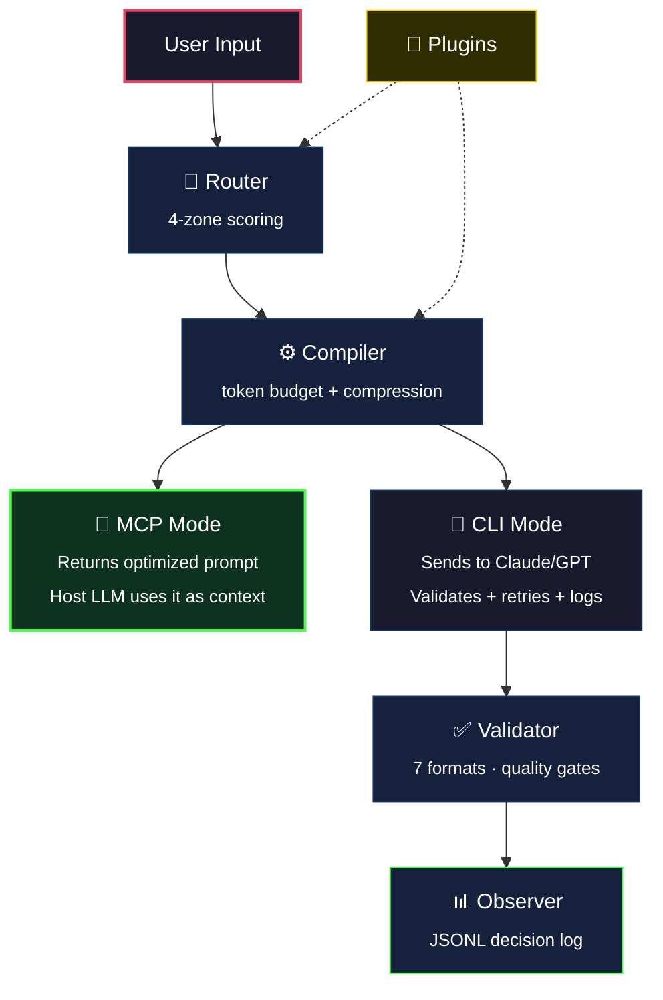

# Prompt Compiler

> Universal prompt compilation engine — routes your intent to the best template, compiles token-budgeted prompts with adversarial-resistant delimiters, and enhances any AI's output quality.

[](CHANGELOG.md)
[](LICENSE)
[](pyproject.toml)
[](#test-suite)

---

## Overview

`promptc` is a prompt compilation engine that transforms raw user input into optimized, template-enhanced prompts. It works in **two modes**:

| Mode | How it works | Best for |
|------|-------------|----------|
| **MCP Server** (recommended) | Runs inside Copilot CLI / Cursor / any MCP client — enhances prompts inline, zero friction | Daily use |
| **Standalone CLI** | Full pipeline with API calls, response validation, retry, and logging | Power users, audit trails |

**Core engine** (shared by both modes):
- 4-zone scoring router (exact → keyword → fuzzy → fallback)
- Token-budget-aware compilation with 4 compression levels
- Adversarial-resistant input delimiters
- Bilingual triggers (English + Georgian)
- Plugin hooks at every pipeline stage

## Architecture



## Quick Start — MCP Server (Recommended)

The fastest way to use promptc. No API keys needed — your AI client (Copilot, Cursor) handles the LLM calls.

### Option A: One-command install (recommended)

```bash
curl -fsSL https://raw.githubusercontent.com/Evil-Null/promptc/main/install.sh | bash
```

This installs via pipx, registers in Copilot CLI config, and verifies everything works.

For local development:

```bash
git clone git@github.com:Evil-Null/promptc.git && cd promptc
./install.sh --local
```

### Option B: Manual install

```bash
# Install
pipx install "prompt-compiler[mcp]"

# Auto-register in Copilot CLI config
promptc-mcp --setup

# Verify installation
promptc-mcp --verify
```

### Option C: Step-by-step

```bash
pipx install "prompt-compiler[mcp]"
```

Register in your MCP client config (`~/.copilot/config.json` for Copilot CLI):

```json
{
  "mcpServers": {
    "promptc": {
      "command": "promptc-mcp",
      "args": []
    }
  }
}
```

Restart your client. Done. Now when you ask Copilot to "review this code for security", it automatically calls promptc to get an optimized system prompt with structured CoT, quality gates, and anti-pattern checks — then uses that enhanced prompt for its own response.

### Diagnostic flags

```bash
promptc-mcp --version   # Print version (e.g., promptc 1.3.0)
promptc-mcp --verify    # Full health check: version, binary, templates, routing, config
promptc-mcp --setup     # Auto-register in Copilot CLI config
```

### MCP Tools

| Tool | Purpose |
|------|---------|
| `promptc_optimize` ⭐ | Compile an optimized system prompt — the AI uses it as context for its own response |
| `promptc_route` | Routing analysis: which template matches, confidence score, zone |
| `promptc_templates` | List all available templates with metadata |
| `promptc_reload` | Hot-reload config, templates, and plugins without restarting |

**Key design**: The MCP server makes **zero API calls**. It returns compiled prompt text for the host LLM's own context. No double-LLM overhead, no extra cost.

## Builtin Templates

| Template | Category | Triggers |
|---|---|---|
| `code-review` | Evaluative | "review this code", "check for bugs", "კოდის რევიუ" |
| `explain` | Instructional | "explain async/await", "what is a closure?", "ახსენი" |
| `architecture` | Generative | "design a microservice", "plan the API", "არქიტექტურა" |
| `security-audit` | Evaluative | "security audit", "vulnerability scan", "უსაფრთხოება" |

> Custom templates: add TOML files to `~/.local/share/prompt-compiler/templates/`

---

## Standalone CLI

For power users who need the full pipeline: API calls to Claude/GPT, response validation, retry with strictness escalation, and JSONL audit logging. **Requires API keys.**

### Install

```bash
git clone git@github.com:Evil-Null/promptc.git
cd promptc
python -m venv .venv && source .venv/bin/activate
pip install -e ".[dev]"

# Verify
mycli version          # → 1.3.0
mycli health --strict  # → all checks pass

# Or use guided setup (registers MCP + verifies)
mycli setup
```

### Authentication (CLI only)

Set your backend API key:

```bash
# Anthropic (standard)
export ANTHROPIC_API_KEY="sk-ant-api03-..."

# Anthropic (OAuth setup token — auto-detected by prefix)
export ANTHROPIC_API_KEY="sk-ant-oat01-..."

# OpenAI
export OPENAI_API_KEY="sk-..."
```

Setup token auto-detection: keys starting with `sk-ant-oat01-` automatically switch to OAuth mode with Bearer auth and billing attribution. No extra configuration.

### CLI Commands

```bash
# Diagnostics
mycli version                                    # Print version
mycli health                                     # System health check
mycli health --strict --json                     # Strict mode, JSON output
mycli templates                                  # List available templates

# Route & Compile (no API call — same as MCP, just in terminal)
mycli route "review this code for bugs"          # Route to best template
mycli route "review this code" --json            # JSON output
mycli compile "explain closures" --template explain              # Compile prompt
mycli compile "explain closures" --template explain --max-tokens 4096

# Run — Full Pipeline (API call + validation + retry + logging)
mycli run "review my auth module" --backend claude --dry-run     # Dry run
mycli run "review my auth module" --backend claude --stream      # Streaming
mycli run "explain async" --template explain --backend gpt       # Explicit template

# Backend Management
mycli backend list                               # Available backends
mycli backend inspect claude                     # Backend capabilities

# Observability
mycli logs                                       # Today's decision log
mycli logs --count 20 --json                     # Last 20 entries as JSON
mycli logs today | week | month                  # Period views
mycli logs search --query "auth"                 # Full-text search
mycli logs prune --days 30                       # Retention pruning

mycli stats                                      # Today's metrics
mycli stats --date 2025-07-15 --json             # Specific date, JSON

# Plugins
mycli plugins                                    # List installed plugins
```

### What CLI adds over MCP

| Feature | MCP | CLI |
|---------|-----|-----|
| Template routing | ✅ | ✅ |
| Prompt compilation | ✅ | ✅ |
| API calls to Claude/GPT | — | ✅ |
| Response validation (7 formats) | — | ✅ |
| Quality gate evaluation | — | ✅ |
| Retry with strictness escalation | — | ✅ |
| JSONL audit logging | — | ✅ |
| Streaming output | — | ✅ |
| Backend selection | — | ✅ |

---

## Pipeline Stages

| Stage | Module | Responsibility |
|---|---|---|
| **Route** | `routing/` | 4-zone template matching with bilingual triggers (EN/KA) |
| **Compile** | `compilation/` | Token-budgeted assembly with 4 compression levels |
| **Adapt** | `adapters/` | Backend-specific payload formatting (Claude, GPT) |
| **Send** | `adapters/transport` | Real HTTP dispatch via httpx (streaming + non-streaming) |
| **Validate** | `validation/` | 7-format schema validation + 3 quality gate evaluators |
| **Retry** | `validation/retry_engine` | Strictness escalation across compression levels |
| **Log** | `observability/` | JSONL decision logging, metrics, pruning, rotation, search |
| **Plugin** | `plugins/` | Hook injection at all 4 stages with 5s timeout enforcement |

> MCP mode uses Route + Compile only. CLI mode uses all stages.

## Security Model

| Layer | Protection |
|---|---|
| **Input isolation** | User input wrapped in `<<<USER_INPUT_START>>>` / `<<<USER_INPUT_END>>>` delimiters |
| **Section ordering** | System directive always first; user input always last |
| **Adversarial resistance** | Marker injection creates multiple splits but system sections precede all markers |
| **Plugin sandboxing** | 5-second timeout per hook, failure isolation, thread-based enforcement |
| **No secrets in code** | 0 hardcoded credentials; backend keys via environment variables only |
| **MCP stdout isolation** | Logging forced to stderr — stdout reserved for MCP JSON-RPC protocol |

## Project Structure

```
src/interceptor/
├── core.py                   # PromptCompilerCore — stateful orchestrator (MCP + API)
├── mcp_server.py             # FastMCP server — 4 tools, stdio transport
├── cli.py                    # Typer CLI with 10 commands
├── config.py                 # TOML config with XDG paths
├── constants.py              # VERSION, paths, defaults
├── health.py                 # 6 health checks
├── template_registry.py      # Builtin + custom template discovery
├── template_loader.py        # TOML → Template parser
├── models/                   # Pydantic template schema
├── routing/                  # 4-zone router + trigger index + scoring
├── compilation/              # Assembler, budget, compressor, tokenizer
├── adapters/                 # Claude + GPT adapters, httpx transport
├── validation/               # 7 format validators, 3 gate evaluators, retry
├── observability/            # JSONL logs, metrics, prune, rotate, search
├── plugins/                  # Discovery, registry, runtime, hooks, install
└── templates/builtin/        # 4 builtin TOML templates
```

## Test Suite

| Metric | Value |
|---|---|
| Total tests | **1312** |
| Failures | **0** |
| Test files | 62 |
| Production files | 59 |
| Production lines | ~7,100 |

```bash
pytest -q                    # Full suite (~7s)
pytest tests/test_core.py -v             # Core orchestrator tests (11)
pytest tests/test_mcp_server.py -v       # MCP server tests (9)
pytest tests/test_setup.py -v            # Setup automation tests (14)
pytest tests/test_pr33_release.py -v     # Release proof
pytest tests/test_routing_golden.py -v   # Golden dataset (28 cases)
```

## Development Phases

| Phase | PRs | Content |
|---|---|---|
| **1. Foundation** | PR-1 | CLI skeleton, config, XDG paths, health |
| **2. Templates** | PR-2 – PR-4 | Schema, registry, trigger index, 4-zone router |
| **3. Compilation** | PR-5 – PR-6 | Token budget, compression, section assembly |
| **4. Backends** | PR-7 – PR-10 | Adapter layer, dry-run, httpx send, SSE streaming |
| **5. Validation** | PR-11 – PR-13 | 5 format validators, quality gates, retry engine |
| **6. Observability** | PR-14 – PR-19 | Decision logs, metrics, prune, rotate, search, periods |
| **7. Plugins** | PR-20 – PR-29 | Manifest, runtime, 4 pipeline hooks, timeout, install |
| **8. Release** | PR-30 – PR-33 | Readiness proof, UTC fix, display alignment, v1.0.0 |
| **9. MCP Integration** | PR-34 | MCP server, Core orchestrator, 4 tools, Copilot CLI support |

> Full history: [CHANGELOG.md](CHANGELOG.md)

## Requirements

- Python ≥ 3.11
- **MCP mode**: `pip install prompt-compiler[mcp]` (adds mcp SDK ~30MB)
- **CLI mode**: `pip install prompt-compiler` (typer, rich, pydantic, httpx)

## Known Limitations

1. **cli.py exceeds 300-line convention** (~1238 lines) — pre-existing; CLI command density justified
2. **No runtime plugin sandboxing** — timeout enforcement is thread-based, not process-isolated
3. **Golden dataset routing is keyword-based** — no semantic/embedding matching (by design for speed)
4. **Backend keys are environment-only** — no vault/secret-manager integration yet
5. **Single-user design** — no multi-tenant log isolation
6. **MCP mode has no logging** — decision log only available in CLI standalone mode

## License

[MIT](LICENSE)
